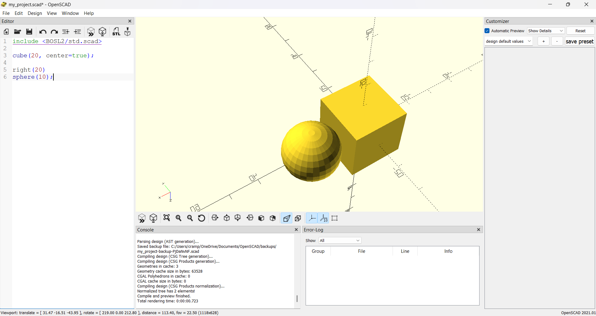
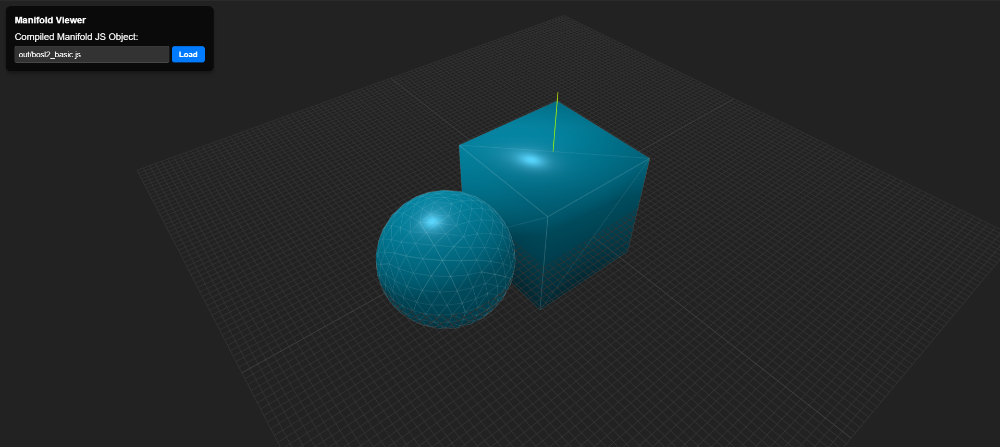
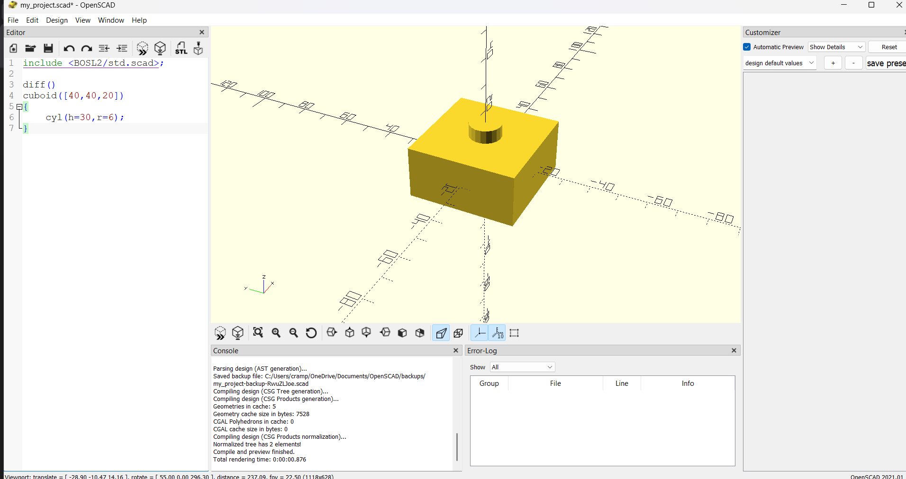
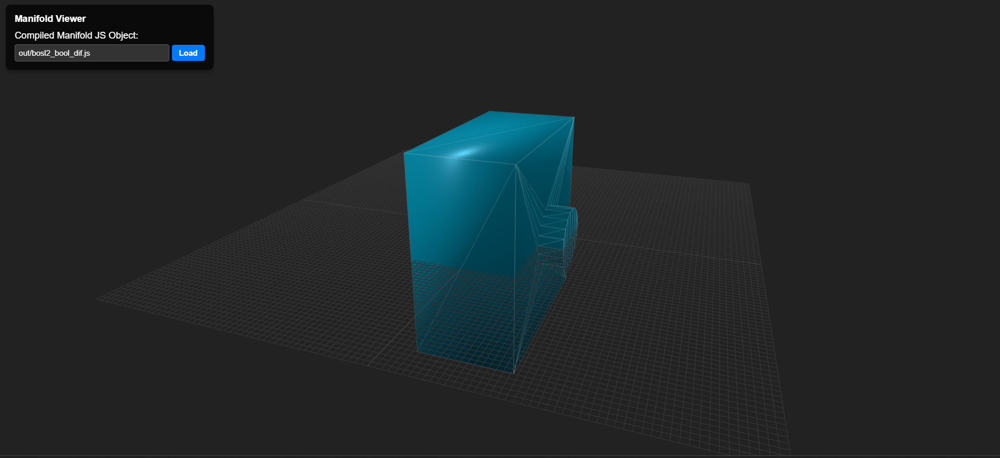
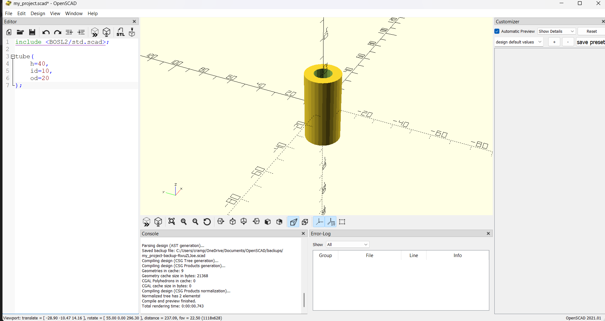
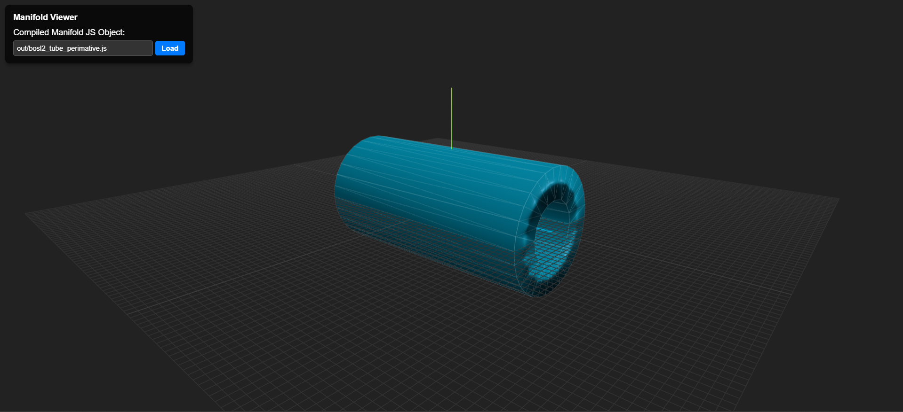
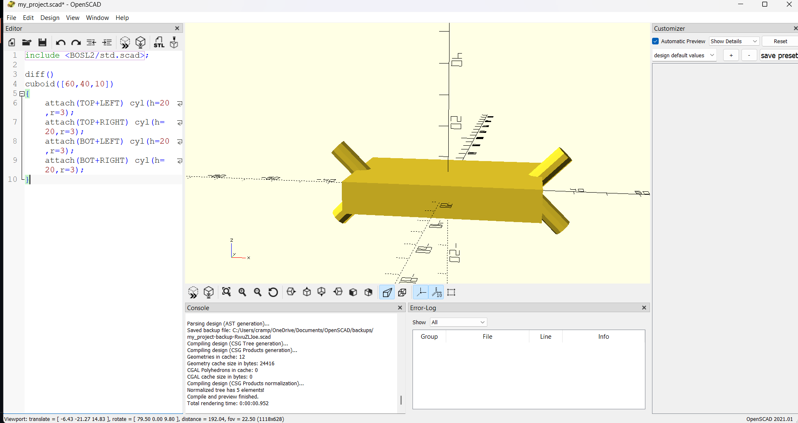
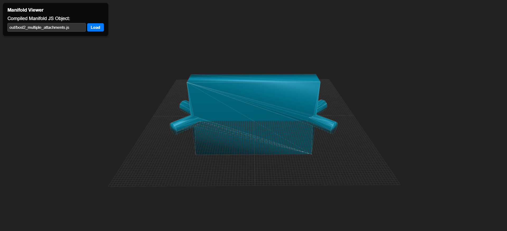

# OpenSCAD → Manifold.js Compiler Comparison

This document shows a visual comparison between the original **OpenSCAD mesh output** and the **compiled Manifold.js mesh output** generated by the prototype of OpenSCAD to Javascript with Manifold.js compiler.

Each example demonstrates whether the compiled Manifold.js geometry matches the original OpenSCAD rendering.

---

## Example 1 – bosl2_basic.scad

| OpenSCAD Output                   | Compiled Manifold.js Output       |
| --------------------------------- | --------------------------------- |
|  |  |

---

## Example 2 – bosl2_bool_dif

| OpenSCAD Output                   | Compiled Manifold.js Output       |
| --------------------------------- | --------------------------------- |
|  |  |

---

## Example 3 – bosl2_tube_perimative.scad

| OpenSCAD Output                   | Compiled Manifold.js Output       |
| --------------------------------- | --------------------------------- |
|  |  |

---

## Example 4 – bosl2_multiple_attachments.scad

| OpenSCAD Output                   | Compiled Manifold.js Output       |
| --------------------------------- | --------------------------------- |
|  |  |

---
